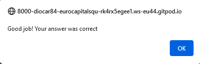

# Euro Capitals Quiz

Euro Capitals Quiz is game desgined to test your knowledge of the capital cities of countries located in the European continent. This game will help improve your geographical awarness and provide you with answers to trivia question you may not have known the solution to before. Since the demise of the U.S.S.R. there are more European countries than ever before and this quiz qill provide you with 49 countries and their respective capital cities.  

Users of this game will get a chance to test their knowledge regarding capital cities of European countries. They may even be able to impress friends and family with their newfound confidence when discussing these countries and their capital cities. This site is geared towards both children and adults whom wish to have a bit of fun while also learning European capital cities.

## Features 

### Existing Features

- __The Header__

  - Featured at the top of the page, the shows the game name: Euro Capitals Quiz! in a font with the color of the starts on the European Union flag. The background of the page is the same color as the blue background of the E.U. flag.
  - There is also a small paragraph meant to inspire the user by delivering a challenging message, "Who is brave enough to play the European capitals quiz game?"
  - This header makes if very clear to the user that they will be participating in a quiz where the question are about european capitals.

- __Username Input Area__

  - This section will allow the user to create a unique  username before starting the quiz.
  - There is a text input area and a large "start game" button.
  - Under the button is a map of Europe with the countries highlighted in different colors. 

- __The Second Header__

  - Featured at the top of the page, the shows the game name: Euro Capitals Quiz! just as before. However, the paragraph below it has been modified.
  - The small paragraph now displays the chosen username and questions the user's knowledge. 

- __The Scoreboard Area__

  - This section will allow the user to see exactly how many correct and incorrect answers they have provided.
  - There is also an element that will display how many question remain before the quiz is finished.

- __The Game Area__

  - This section will provide the user with the country and flag for which they must reply with the capital city.
  - There is text input field where the user may write their response, and a submit button directly below it.
  - There are also two buttons at the bottom: The new game button will refresh the game and allow the user to start over. The quit game button will end the game and direct the user back to the username creation section.

- __How The Game Works__

  - The game will randomly generate a country and flag from a predefined list. The user will then have to respond with the capital city of said country.
  - If the user answers correctly, they will receive an alert congratulating them on their answer.
  - However, if the user is incorrect, they will receive an alert advising them they have not answered correctly, as well as, what the correct response was.
  - The scoreboard will then add 1 to the number of correct/incorrect answers based on the outcome and also reduce the number of remaining questions left by 1.
  - When the user quits the game, they will receive an alert with the number of correct and incorrect responses they provided.

    

### Features Left to Implement

- I would like to add an external link to a website with all of the European countries and their respective capitals.
- I would like to expand the quiz to not only Europe, but other continents as well.
- I would like to add language options, so that the user may choose to play in Portuguese or Spanish as well.

## Testing 

- I tested playing this game in different browsers: Chrome, Firefox, Safari.
- I confirmed that the game results are always correct.
- I confirmed that the header, scoreboard and game areas are all readable and easy to understand.
- I confirmed that the colors and fonts chosen are easy to read and accessible by running it through lighthouse in devtools.

- I confirmed that this project is responsive, looks good and functions on all standard screen szes using devtools device toolbar.

### Validator Testing 

- HTML
    - No errors were returned when passing through the official [W3C validator](https://validator.w3.org/nu/?doc=https%3A%2F%2Fdiocar84.github.io%2FEuro_Capitals_Quiz%2F)
- CSS
    - No errors were found when passing through the official [(Jigsaw) validator](https://jigsaw.w3.org/css-validator/validator?uri=https%3A%2F%2Fdiocar84.github.io%2FEuro_Capitals_Quiz%2F&profile=css3svg&usermedium=all&warning=1&vextwarning=&lang=en)
- JavaScript
    - No errors were found when passing through the official [Jshint validator](https://jshint.com/)
      - The following metrics were returned: 
      - There are 11 functions in this file.
      - Function with the largest signature takes 2 arguments, while the median is 0.
      - Largest function has 10 statements in it, while the median is 3.
      - The most complex function has a cyclomatic complexity value of 4 while the median is 2.

### Unfixed Bugs

You will need to mention unfixed bugs and why they were not fixed. This section should include shortcomings of the frameworks or technologies used. Although time can be a big variable to consider, paucity of time and difficulty understanding implementation is not a valid reason to leave bugs unfixed. 

## Deployment

This section should describe the process you went through to deploy the project to a hosting platform (e.g. GitHub) 

- The site was deployed to GitHub pages. The steps to deploy are as follows: 
  - In the GitHub repository, navigate to the Settings tab 
  - From the source section drop-down menu, select the Master Branch
  - Once the master branch has been selected, the page will be automatically refreshed with a detailed ribbon display to indicate the successful deployment. 

The live link can be found here - https://code-institute-org.github.io/love-maths/

## Credits 

In this section you need to reference where you got your content, media and extra help from. It is common practice to use code from other repositories and tutorials, however, it is important to be very specific about these sources to avoid plagiarism. 

You can break the credits section up into Content and Media, depending on what you have included in your project. 

### Content 

- The text for the Home page was taken from Wikipedia Article A
- Instructions on how to implement form validation on the Sign Up page was taken from [Specific YouTube Tutorial](https://www.youtube.com/)
- The icons in the footer were taken from [Font Awesome](https://fontawesome.com/)

### Media

- The photos used on the home and sign up page are from This Open Source site
- The images used for the gallery page were taken from this other open source site

Congratulations on completing your Readme, you have made another big stride in the direction of being a developer! 

## Other General Project Advice

Below you will find a couple of extra tips that may be helpful when completing your project. Remember that each of these projects will become part of your final portfolio so it’s important to allow enough time to showcase your best work! 

- One of the most basic elements of keeping a healthy commit history is with the commit message. When getting started with your project, read through [this article](https://chris.beams.io/posts/git-commit/) by Chris Beams on How to Write  a Git Commit Message 
  - Make sure to keep the messages in the imperative mood 

- When naming the files in your project directory, make sure to consider meaningful naming of files, point to specific names and sections of content.
  - For example, instead of naming an image used ‘image1.png’ consider naming it ‘landing_page_img.png’. This will ensure that there are clear file paths kept. 

- Do some extra research on good and bad coding practices, there are a handful of useful articles to read, consider reviewing the following list when getting started:
  - [Writing Your Best Code](https://learn.shayhowe.com/html-css/writing-your-best-code/)
  - [HTML & CSS Coding Best Practices](https://medium.com/@inceptiondj.info/html-css-coding-best-practice-fadb9870a00f)
  - [Google HTML/CSS Style Guide](https://google.github.io/styleguide/htmlcssguide.html#General)

Getting started with your Portfolio Projects can be daunting, planning your project can make it a lot easier to tackle, take small steps to reach the final outcome and enjoy the process! 